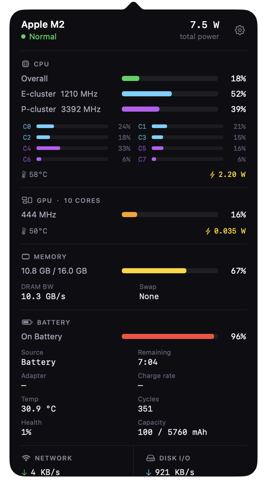
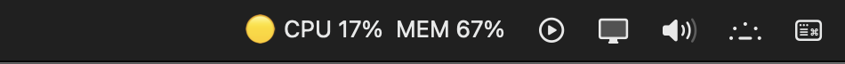
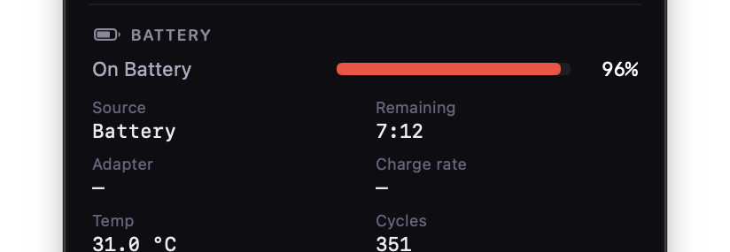

<div align="center">

# MacMonitor

**The most complete Apple Silicon system monitor that fits in your menu bar.**

Real-time CPU, GPU, memory, battery, power rails, network, and disk — all in a single click.

<br/>

[](https://www.apple.com/macos/)
[](https://www.apple.com/mac/m1/)
[](https://swift.org)
[](https://developer.apple.com/xcode/swiftui/)
[](https://developer.apple.com/widgets/)
[](LICENSE)

<br/>

> *MacMonitor lives in your menu bar, shows a live 🟢/🟡/🔴 health dot, and opens a full dark-mode dashboard with every metric your Mac produces — all without a single Dock icon.*

<br/>

<!-- Screenshot row -->
<table>
  <tr>
    <td></td>
    <td></td>
    <td></td>
  </tr>
  <tr>
    <td align="center"><sub>Full dashboard</sub></td>
    <td align="center"><sub>Menu bar indicator</sub></td>
    <td align="center"><sub>Battery &amp; power detail</sub></td>
  </tr>
</table>

</div>

---

## What's inside

MacMonitor pulls data from **four independent sources** and stitches them into a single, always-current dashboard:

| Source | Data | Needs sudo? |
|--------|------|-------------|
| **Mach kernel** (`host_processor_info`) | CPU per-core ticks, overall %, E/P cluster split | No |
| **Mach kernel** (`vm_statistics64`) | Memory used, free, compressed, swap, DRAM bandwidth | No |
| **mactop** (Apple Silicon perf counters) | GPU %, GPU MHz, CPU/GPU temps, ANE power, DRAM power, system power, per-cluster MHz | Once (cached by macOS) |
| **pmset / ioreg** | Battery %, charging state, charge rate (W), adapter watts, cycle count, health %, capacity mAh, temperature | No |

Everything refreshes every **2 seconds** in the menu bar and dashboard. The desktop widget uses its own independent Mach kernel sampling and refreshes every **5 seconds** — no background process required.

---

## Features at a glance

### Menu bar indicator

Updates every 2 s. One look tells you if everything is fine.

```
🟢 CPU 12%  MEM 47%    →  all clear
🟡 CPU 62%  MEM 71%    →  moderate load
🔴 CPU 91%  MEM 87%    →  heavy load — open dashboard to see what's hot
```

### Full dashboard (click to open)

| Section | What you see |
|---------|-------------|
| **Header** | Chip name · thermal state · total system power · gear icon for Settings |
| **CPU** | Overall bar · E-cluster bar · P-cluster bar · per-core mini-bars · temp pill · CPU power pill |
| **GPU** | Usage bar · frequency (MHz) · temperature · GPU power pill |
| **Memory** | Used/total bar · DRAM bandwidth (GB/s read + write) · swap used |
| **Battery** | Charge % · status · charge rate · adapter watts · cycles · health · current/max/design mAh · cell temp |
| **Network** | Live download speed · live upload speed (auto-scaled B/KB/MB) |
| **Disk I/O** | Live read throughput · live write throughput (auto-scaled) |
| **Power rails** | CPU · GPU · ANE · DRAM · System · Total — six tiles, always visible |
| **Processes** | Top 8 CPU consumers — name, CPU %, memory |
| **Optimize** | Purges disk cache + offers to gracefully quit heavy apps |

### Desktop widget

Drop it on your desktop (macOS Sonoma/Sequoia) or in Notification Centre. Available in two sizes:

- **Small** — CPU, GPU, Memory bars with temperatures
- **Medium** — All bars + network speed + power draw

The widget runs **completely standalone** — it collects its own data via Mach kernel APIs, so it keeps working even if you quit the menu bar app.

---

## Installation

### Option A — Homebrew (easiest, auto-updates)

```bash
brew tap ryyansafar/macmonitor https://github.com/ryyansafar/MacMonitor
brew install --cask macmonitor
```

That's it. MacMonitor appears in your menu bar immediately.

**Upgrade when a new version is released:**

```bash
brew upgrade --cask macmonitor
```

Every time a new version is tagged on GitHub, the Homebrew formula updates automatically within minutes via CI. Your next `brew upgrade` picks it up.

> macOS is the only supported platform — MacMonitor requires Apple Silicon hardware. Linux package managers (apt-get, yum, snap, pacman) and Windows package managers (Winget, Chocolatey, Scoop) do not apply.

---

### Option B — One-line installer

Installs Homebrew, mactop, configures passwordless sudo, downloads the DMG, and launches MacMonitor — everything in one step:

```bash
curl -fsSL https://raw.githubusercontent.com/ryyansafar/MacMonitor/main/install.sh | bash
```

The installer will:
1. Verify you're on Apple Silicon + macOS 13+
2. Install Homebrew (if not already installed)
3. Install `mactop` via Homebrew
4. Configure `/etc/sudoers.d/macmonitor` for passwordless mactop access (so you're never prompted mid-session)
5. Download and install the latest `MacMonitor.dmg` from GitHub Releases
6. Remove the quarantine flag so macOS doesn't block the unsigned app
7. Launch MacMonitor immediately

---

### Option C — Drag to Applications (manual)

1. Go to [**Releases**](../../releases/latest) and download **MacMonitor.dmg**
2. Open the DMG — you'll see this window:

```
┌──────────────────────────────────────┐
│                                      │
│   [MacMonitor.app]  →  [Applications]│
│                                      │
└──────────────────────────────────────┘
```

3. Drag **MacMonitor** onto **Applications**
4. Eject the DMG
5. Open MacMonitor from Applications (or Spotlight: `Cmd+Space` → "MacMonitor")

> **First launch on macOS:** If you see "MacMonitor cannot be opened because it is from an unidentified developer", go to **System Settings → Privacy & Security**, scroll down, and click **Open Anyway**. This happens once because the app isn't notarised (no paid Apple Developer account required).

---

### Option D — Build from source

**Prerequisites**

- Xcode 15 or later
- Apple Silicon Mac (M1 / M2 / M3 / M4)
- macOS 13 Ventura or later

**1. Install mactop**

```bash
brew install mactop
```

**2. Clone and open**

```bash
git clone https://github.com/ryyansafar/MacMonitor.git
cd MacMonitor
open Macmonitor.xcodeproj
```

**3. Set your signing team**

In Xcode:
- Select the **Macmonitor** project in the navigator
- Go to **Signing & Capabilities** for the `Macmonitor` target
- Set **Team** to your Apple ID (free account works fine)
- Do the same for the `MacMonitorWidget` target

**4. Run**

Press `Cmd+R`. MacMonitor appears in your menu bar — there's no Dock icon by design.

**5. Configure passwordless sudo (optional)**

For GPU temperature and power data, mactop needs sudo. To avoid password prompts:

```bash
MACTOP=$(which mactop)
echo "$(whoami) ALL=(ALL) NOPASSWD: $MACTOP" | sudo tee /etc/sudoers.d/macmonitor
sudo chmod 440 /etc/sudoers.d/macmonitor
```

---

## Adding the desktop widget

**Desktop (macOS Sonoma / Sequoia):**

1. Right-click an empty area of your desktop
2. Click **Edit Widgets**
3. Search for **MacMonitor**
4. Choose **Small** or **Medium** — click or drag to place it
5. Click **Done**

**Notification Centre:**

1. Click the clock in the top-right corner of your menu bar
2. Scroll to the bottom → **Edit Widgets**
3. Find **MacMonitor** → click `+`
4. Drag it to your preferred position

> The widget collects its own data independently using macOS Mach kernel APIs, so it works even without the menu bar app running.

---

## How it works

```
┌──────────────────────────────────────────────────────────────────┐
│                        MacMonitor.app                            │
│                                                                  │
│  ┌─────────────┐     ┌──────────────────────────────────────┐   │
│  │ AppDelegate │     │         SystemStatsModel              │   │
│  │             │     │                                       │   │
│  │ NSStatusItem│     │  CPU  ←  host_processor_info()       │   │
│  │   (2s tick) │◄────│  MEM  ←  vm_statistics64()           │   │
│  │             │     │  NET  ←  netstat -ib (delta)         │   │
│  │ NSPopover   │     │  DISK ←  IOKit disk stats (delta)    │   │
│  │  (SwiftUI)  │     │  GPU  ←  sudo mactop --headless      │   │
│  │             │     │  BAT  ←  pmset + ioreg               │   │
│  └─────────────┘     └──────────────────────────────────────┘   │
└──────────────────────────────────────────────────────────────────┘

┌──────────────────────────────────────────────────────────────────┐
│                    MacMonitorWidget extension                     │
│                                                                  │
│  ┌──────────────────────────────────────────────────────────┐   │
│  │  StatsProvider (TimelineProvider)                        │   │
│  │                                                          │   │
│  │  CPU  ←  host_processor_info() [0.8 s two-sample delta] │   │
│  │  MEM  ←  vm_statistics64()                              │   │
│  │  THRM ←  ProcessInfo.thermalState                       │   │
│  │                                                          │   │
│  │  Refreshes every 5 seconds — fully standalone           │   │
│  └──────────────────────────────────────────────────────────┘   │
└──────────────────────────────────────────────────────────────────┘
```

MacMonitor is intentionally **not sandboxed**. macOS sandbox restrictions would prevent reading CPU tick counters, running mactop, and accessing battery data via ioreg. The entitlements file disables App Sandbox, which is why the app can't be submitted to the Mac App Store — but it can be freely distributed as a DMG.

---

## Resetting first-launch onboarding

If you want to see the welcome screen again:

```bash
defaults delete rybo.Macmonitor hasLaunched
```

Then relaunch MacMonitor.

---

## Project structure

```
Macmonitor/
├── Macmonitor.xcodeproj/
├── Macmonitor/                         ← Main app target
│   ├── MacmonitorApp.swift             App entry point (@main)
│   ├── AppDelegate.swift               NSStatusItem, NSPopover, click handling
│   ├── SystemStatsModel.swift          All data collection (ObservableObject)
│   ├── PopoverView.swift               SwiftUI dashboard + SettingsSheet
│   ├── WelcomeView.swift               3-step first-launch onboarding
│   ├── MacMonitor.entitlements         No App Sandbox (required)
│   └── Assets.xcassets/
├── MacMonitorWidget/                   ← Widget extension target
│   └── MacMonitorWidget.swift          WidgetKit small + medium (standalone)
├── scripts/
│   └── build-dmg.sh                    Packages a drag-to-install DMG
├── install.sh                          One-line curl installer
└── README.md
```

---

## Releasing a new version

1. Bump `CFBundleShortVersionString` in Xcode (project → Info tab) to match the new version
2. Commit the change: `git commit -am "chore: bump version to 1.x.0"`
3. Tag and push:
   ```bash
   git tag v1.x.0
   git push origin main --tags
   ```

GitHub Actions does the rest automatically:
- **`release.yml`** — builds the DMG on a macOS runner and publishes a GitHub Release with the `.dmg` attached
- **`update-brew.yml`** — downloads the new DMG, computes its SHA256, and commits an updated `Casks/macmonitor.rb` — so `brew upgrade --cask macmonitor` delivers the new version within minutes

---

## Building the DMG yourself

```bash
cd Macmonitor
chmod +x scripts/build-dmg.sh
./scripts/build-dmg.sh
```

Output: `dist/MacMonitor-1.0.0.dmg`

The script archives the project with `xcodebuild`, exports the `.app`, creates a read-write DMG with `hdiutil`, uses AppleScript to set the Finder window layout and icon positions, then converts it to a compressed read-only DMG.

To create a GitHub release from the DMG:

```bash
gh release create v1.0.0 "dist/MacMonitor-1.0.0.dmg" \
  --title "MacMonitor v1.0.0" \
  --notes-file CHANGELOG.md
```

---

## Contributing

Contributions are welcome and genuinely appreciated. Whether you're fixing a bug, improving the UI, adding a new metric, or writing documentation — please open an issue first so we can discuss the approach.

See [CONTRIBUTING.md](CONTRIBUTING.md) for the full guide, including dev setup, code style, and PR process.

---

## Support the project

MacMonitor is free and open source. If it saves you time or you just like it, a coffee goes a long way:

[](https://buymeacoffee.com/ryyansafar)
[](https://www.paypal.com/paypalme/ryyansafar)
[](https://razorpay.me/@ryyansafar)

---

## Acknowledgements

- [mactop](https://github.com/metaspartan/mactop) by [@metaspartan](https://github.com/metaspartan) — exposes Apple Silicon performance counters that macOS doesn't surface through public APIs
- Apple's Mach kernel interfaces (`host_processor_info`, `vm_statistics64`) for dependency-free CPU and memory sampling

---

## License

[MIT](LICENSE) — Copyright (c) 2025–2026 MacMonitor Contributors.

Free to use, modify, fork, and distribute. Attribution appreciated but not required.

---

<div align="center">

Built for Apple Silicon. Runs on the metal.

© 2025–2026 MacMonitor Contributors — [MIT License](LICENSE)

</div>
